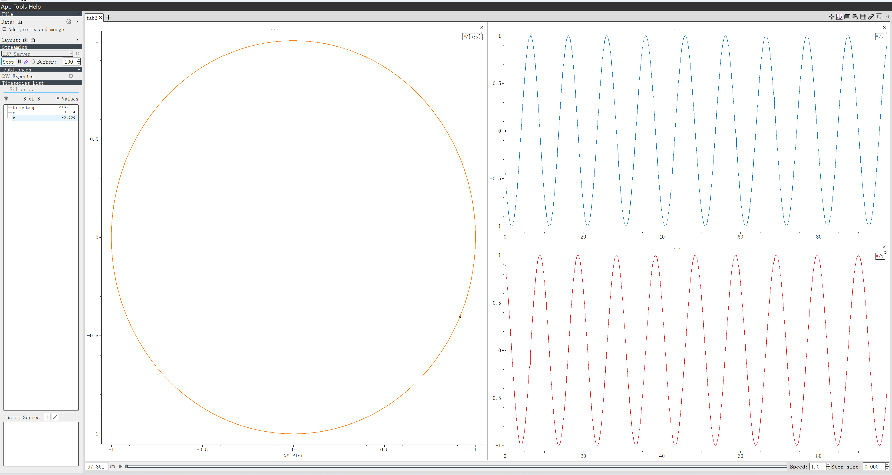

# 📖 CCurve 

Ccurve is a header-only curve data management tool that provides convenient curve data registration, publishing and other functions.

# [Plotjuggler](https://github.com/facontidavide/PlotJuggler)  Demo


Through simple curve registration and publishing, the data in the program can be visualized in plotjuggler.
```c++
#include <CCurve/sink.hpp>
CURVE_REGISTRY_ENABLE
int main(int argc, char *argv[])
{
    CURVE_REGISTRY("tmp", (double, "timestamp", 0)(float, "x", 0.)(float, "y", 0.));
    CURVE_REGISTRY_NORMAL_SINK(std::make_shared<curve::UDPSink>());
    while (1)
    {
        static double ts = 0.;

        CURVE_RECORD("tmp", "timestamp", ts);
        CURVE_RECORD("tmp", "x", float(std::cos(ts)));
        CURVE_RECORD("tmp", "y", float(std::sin(ts)));
        CURVE_FLUSH;

        ts += 0.03;
        using namespace std::chrono_literals;
        std::this_thread::sleep_for(30ms);
    }
    return 0;
}
```


